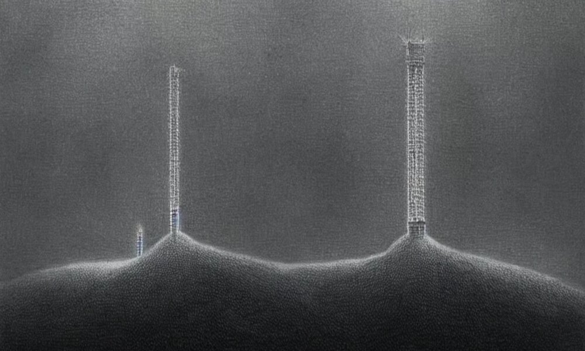
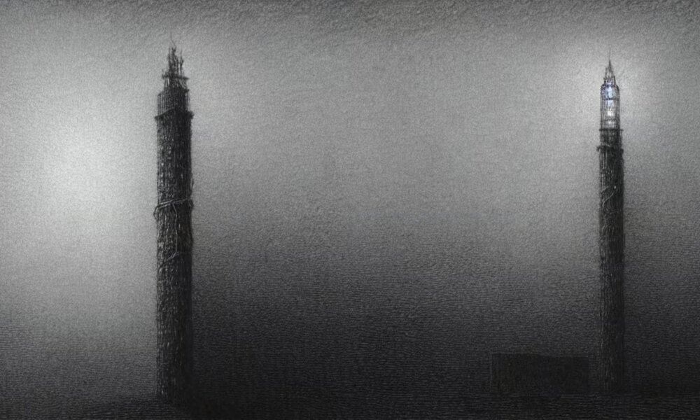
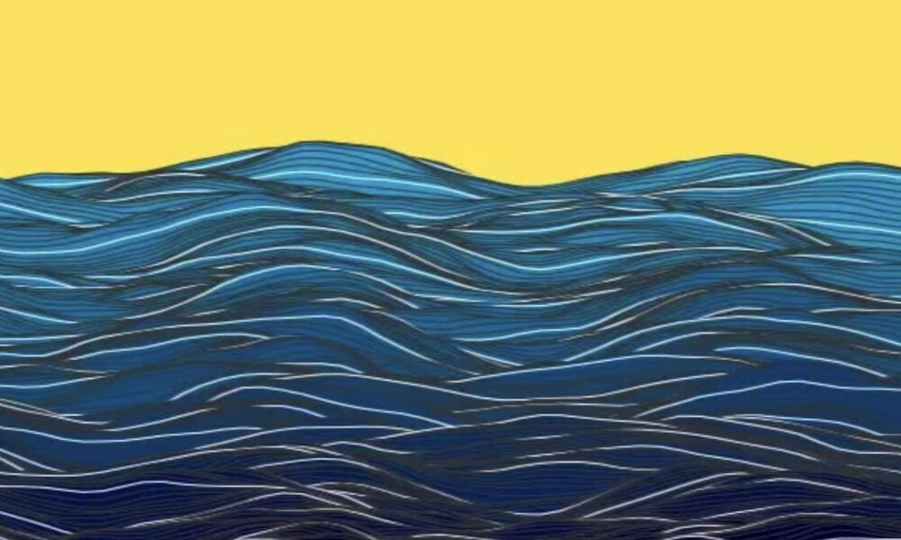

# ldai0199_9103_tut3_Major_Project

## Animated Claude Monet
Welcome to my IDEA9103 Creative Coding Major Project (Individual Task)! This project creates a dynamic, responsive canvas drawing using p5.js, featuring shapes, buildings, shadows, and colors with Perlin noise and random values for organic animations.

### **Instructions**
How to interact with the work:

- Load the webpage, and the animation will start automatically.

- The animation uses Perlin noise and random values to create organic movements in specifically with the river and buildings.
The shapes and colors will change and animate continuously.

- Resize the browser window to see the canvas adjust and maintain the proportions of the animation.

## Details of My Individual Approach to Animating the Group Code
### Animation Method: Perlin Noise
I've chosen to animate my group's code using **Perlin noise** due to its creative potential. Perlin noise offers a dynamic and versatile toolset, with its ability to simulate intricate and organic patterns. By harnessing Perlin noise, I can generate visually captivating effects that breathe life into the art piece.

### Why Perlin Noise?
I've chosen Perlin noise because of its potential to simulate waves and reflections on water surfaces, which I thought would be ideal for bringing life to the picture, considering that half of the image comprises water. Since Perlin noise is typically used to generate smoothly varying values that can simulate natural phenomena, such as waves or organic patterns, I believed that incorporating it into the positions of the lines could help create an animated effect that mimics the behavior of natural elements and infrastructures. 

### Animated Properties and Uniqueness
In my implementation, I animate the positions of the lines that fill the river and buildings using Perlin noise. This approach creates the illusion of moving waves and shimmering reflections of buildings. As for my group memebers:

- ***Nicholas*** uses mouse movement to incorporate interactivity. As the mouse moves across the page, the colors change to simulate the transition from day to night, creating a dynamic and immersive experience.

- ***Joyya*** employs the millis() function to time events and animations. Her approach synchronizes the movement of buildings and the ocean over time, offering a cohesive and rhythmic visual presentation.

In contrast, my animation focuses on the continuous, natural motion of the lines using Perlin noise. How I acheive this is as follows (You can find examples of images that influence my inspiration below.):

- River Waves: I animate the horizontal lines within the river using Perlin noise to simulate gentle, flowing waves.
 
- Building Reflections: I animate the vertical lines within the buildings using Perlin noise to create a shimmering effect, resembling sunlight reflecting off the surfaces. 
  

### Example 1:
 
[Stable Diffusion](https://www.prompthunt.com/prompt/cl8j88jm916821tdqyprk1hos2?selectedAsset=cl8j88k3217176tdqyfnrvmu21)

### Example 2:

[Stable Diffusion](https://www.prompthunt.com/prompt/cl8j88jm916821tdqyprk1hos2?selectedAsset=cl8j88k3217176tdqyfnrvmu21)
### Example 3:
 
[Drawing Waves](https://medium.com/@yanhann10/drawing-waves-with-p5-js-444f447bdc39)

## Enhancements and Modifications

My animation is achieved through continuous drawing, Perlin noise, and random values to produce organic, flowing visuals. Key elements include:

1. **Continuous Drawing Loop**:
   - The `loop()` function in `setup()` allows `draw()` to run continuously, creating real-time animations.

2. **Perlin Noise and Random Values**:
   - `noiseOffset` is used to generate smooth, non-repetitive motion in the animations. This creates natural-looking wave effects and randomness in shapes.

3. **Wavy Line Fills**:
   - The `fillShapeWithWavyLines()` and `fillShapeWithVerticalWavyLines()` functions fill shapes with dynamic wavy lines. These lines are animated using Perlin noise to vary their heights and widths, simulating ripples of water and shimmering building surfaces.

4. **Consistent Randomness**:
   - A fixed random seed (`randomSeed(42)`) ensures that the animations are consistent across different runs, providing reproducibility.

### References

- [p5.js Reference](https://p5js.org/reference/#/p5/noise)
- [Drawing Wavess](https://medium.com/@yanhann10/drawing-waves-with-p5-js-444f447bdc39)
- [Stable Diffusion](https://www.prompthunt.com/prompt/cl8j88jm916821tdqyprk1hos2?selectedAsset=cl8j88k3217176tdqyfnrvmu21)
- IDEA9103 Week 10 Tutorial and Quiz

